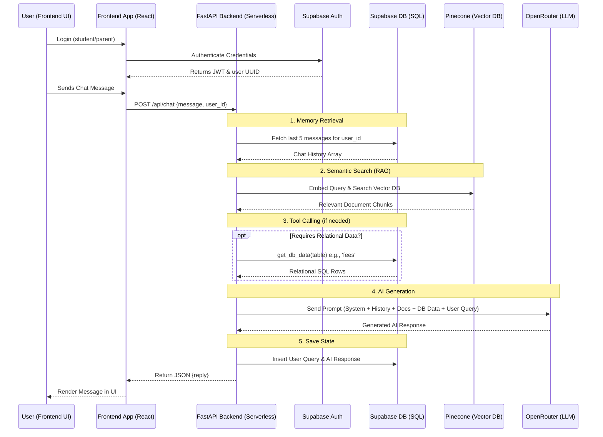

# 🎓 AI-Powered School Website + RAG Chatbot

An intelligent, full-stack monorepo web application designed for educational institutions. This platform provides a modern, responsive frontend for the school combined with a powerful AI Chatbot (Retrieval-Augmented Generation) that acts as a virtual assistant for students and parents.

## 🌟 Key Features

- **Modern Landing Page**: Premium and responsive design for the school's online presence.
- **Role-Based Authentication**: Secure access for 'Students' and 'Parents' using Supabase Auth.
- **RAG Virtual Assistant**: An AI chatbot that can answer questions based on school documents (fees policy, holidays, syllabus, etc.).
- **Database Tool Calling**: The AI dynamically queries real-time relational data (e.g., specific student textbook availability or fee structures) via Function Calling.
- **Persistent Memory**: Chat history is saved securely, allowing continuous, contextual conversations across sessions.

---

## 🛠️ Technology Stack

This project is built using a modern decoupled architecture, combining the best tools for web development and AI:

### Frontend
- **Framework**: Next.js / React (Vite)
- **Chatbot UI**: Gradio (Mounted on FastAPI and embedded via iframe)
- **Styling**: Vanilla CSS / Tailwind CSS
- **Deployment**: Vercel (`@vercel/next` / static)

### Backend (API & AI)
- **Framework**: Python FastAPI
- **LLM Provider**: OpenRouter (`openai/gpt-4o-mini`)
- **Deployment**: Vercel Serverless Functions (`@vercel/python`)

### Data & Storage
- **Relational DB & Auth**: Supabase (PostgreSQL + RLS Policies)
- **Vector Database**: Pinecone
- **Embeddings**: SentenceTransformers (`all-MiniLM-L6-v2` via Hugging Face) <!-- Downloads and runs the open-source embedding model locally using the Hugging Face Hub -->
- **AI Orchestration**: LangChain (for chunking and document splitting)

---

## 🏛️ Architecture & Call Flow

The application follows a decoupled monorepo approach where the frontend serves the UI and communicates with the Python Serverless backend for all AI and data logic.

### 🔄 Simple Call Flow

1. **User Login**: The user (Student/Parent) logs into the frontend, authenticating via Supabase Auth to receive a secure token.
2. **Query Submission**: The user sends a chat message through the UI, which the frontend forwards to the backend API (`/api/chat`).
3. **Memory Retrieval**: The backend retrieves the user's recent chat history from the Supabase database to maintain conversational context.
4. **Semantic Search (RAG)**: The backend embeds the query and searches the Pinecone Vector DB for relevant school documents (e.g., policies, syllabus, holidays).
5. **Database Lookup (Tool Calling)**: If the query requires structured data (like specific fees or textbook stock), the backend directly queries the Supabase SQL database.
6. **AI Generation**: The backend combines the history, retrieved documents, DB data, and the user's query into a prompt for the LLM (via OpenRouter) to generate a response.
7. **Save & Respond**: The generated AI response is saved back to the database for future memory, and then returned to the frontend to be displayed to the user.



---

## 🧠 How RAG Works (Conceptual Note)

If you are new to Retrieval-Augmented Generation (RAG), here is a simple analogy of how the AI and Pinecone interact behind the scenes:

1. **Embeddings & Vectors**: Think of a massive 384-dimensional map where sentences are placed based on their *meaning*. An "Embedding" is the process of finding the exact GPS coordinate for a sentence on this map, and a "Vector" is the list of those 384 numbers (e.g., `[-0.03, 0.51, ...]`).
2. **Hugging Face**: This acts as our "GPS Device." When a user asks a question, we send the text to the Hugging Face Inference API, which calculates the meaning and returns the 384-number vector coordinate.
3. **Pinecone**: Pinecone is a specialized "Coordinate Database." Unlike traditional SQL databases that search for exact word matches, you give Pinecone a vector coordinate, and it instantly calculates the math to find all other document coordinates physically closest to it on the map. 
4. **The Chatbot**: The chatbot acts as the translator. It takes your English question, gets the coordinates from Hugging Face, uses Pinecone to find the nearest school documents based on those coordinates, and then uses an LLM to read those documents and answer your question in plain English!

---

## 🤖 Multi-Table Data Routing Example

The Chatbot is not only capable of reading PDF documents via Pinecone, but it actively routes complex queries to the live **Supabase Relational Database**. 

If a user asks a multi-part question that spans different domains (e.g., *Fees* and *Textbooks*), the backend instantly detects the context, fetches the live data from **both** SQL tables simultaneously, and merges the result.

**Example User Query:**
> *"I have two kids, one in grade 3 and one in grade 10. Can you tell me their total annual fees and if their books are in stock?"*

**Example Chatbot Response:**
> *Based on the live database records:*
> *- For your Grade 3 student, the annual fee is ₹54,000, and the complete textbook sets are currently available in the library.*
> *- For your Grade 10 student, the annual fee is ₹80,000, but please note that their textbooks are currently out of stock as we are awaiting the new syllabus shipment next week.*
> *The total annual fee for both students combined is ₹134,000.*

**Example 2: RAG Vector Search (School Documents)**
> **User:** *"When are the midterm and final exams scheduled, and when is the summer vacation?"*
> 
> *(Vector Search retrieves the following context from Pinecone: "Exam Schedule: Mid-Term: September, Final Exams: March... School Holidays: Summer Vacation: May 1 – June 10.")*
> 
> **Chatbot:** *"According to the school schedule, the Mid-Term exams are in September and the Final Exams are in March. The Summer Vacation runs from May 1 to June 10."*

**Example 3: Relational Database Lookup (Single Table)**
> **User:** *"What is the tuition fee for grade 6?"*
> **Chatbot:** *"The tuition fee for grade 6 is ₹5,000 (with an annual fee of ₹62,000)."*

**Example 4: Contextual Memory**
> **User:** *"And what about grade 7?"*
> **Chatbot:** *"For grade 7, the tuition fee is ₹5,200 (with an annual fee of ₹64,000)."*

---

## 📂 Project Structure

```text
AIRAGChatbot-Edu/
├── frontend/             # Next.js/React frontend application
├── backend/              # Python FastAPI server and AI logic
│   ├── main.py           # FastAPI entrypoint (/api/chat)
│   ├── rag_chatbot.py    # Core RAG, memory, and LLM orchestration logic
│   ├── upload_to_pinecone.py # Script to upload local docs to Pinecone
│   ├── requirements.txt  # Python dependencies
│   └── data/docs/        # Raw text files for the knowledge base
├── vercel.json           # Vercel deployment configuration
├── design.md             # High-level architecture and system design
├── Project Requirements.md # Original project constraints and goals
├── README.md             # Project documentation
└── development_phases/   # Step-by-step guides and development prompts
```

---

## 🚀 Quick Start Guide

### 1. Prerequisites
- Python 3.9+
- Node.js 18+
- Accounts on Supabase, Pinecone, OpenRouter, and Vercel.

### 2. Environment Setup
Create a `.env` file in the root directory and/or backend directory:
```env
OPENROUTER_API_KEY=your_openrouter_api_key
SUPABASE_URL=your_supabase_url
SUPABASE_KEY=your_supabase_anon_key
PINECONE_KEY=your_pinecone_api_key
PINECONE_ENV=your_pinecone_environment
```

### 3. Running Locally

**Terminal 1 (Backend):**
```bash
cd backend
python -m venv venv
source venv/bin/activate  # or `venv\Scripts\activate` on Windows
pip install -r requirements.txt
uvicorn main:app --reload --port 8000
```
*➡️ Backend API is now running at: **`http://localhost:8000`***
*➡️ Gradio Chat UI is available at: **`http://localhost:8000/chat-ui`***

**Terminal 2 (Frontend):**
```bash
cd frontend
npm install
npm run dev
```
*➡️ Frontend Web App is now running at: **`http://localhost:5173`***

---

## 🔐 Demo Credentials

You can use the following pre-configured credentials to test the application:

| Role | Username / Email | Password |
| :--- | :--- | :--- |
| **Parent 1** | `parent1@gmail.com` | `parent1` |
| **Parent 2** | `parent2@gmail.com` | `parent2` |

---

## 🌐 Deployment

The application is configured to be deployed as a monorepo on **Vercel**. 
The `vercel.json` file dictates the routing:
- `/api/*` endpoints are routed to the Python Serverless environment (`backend/main.py`).
- All other paths are automatically handled by the frontend framework.

To deploy, simply import your GitHub repository into Vercel, inject the environment variables into the project settings, and Vercel will handle building both the frontend and the Python serverless functions automatically.
